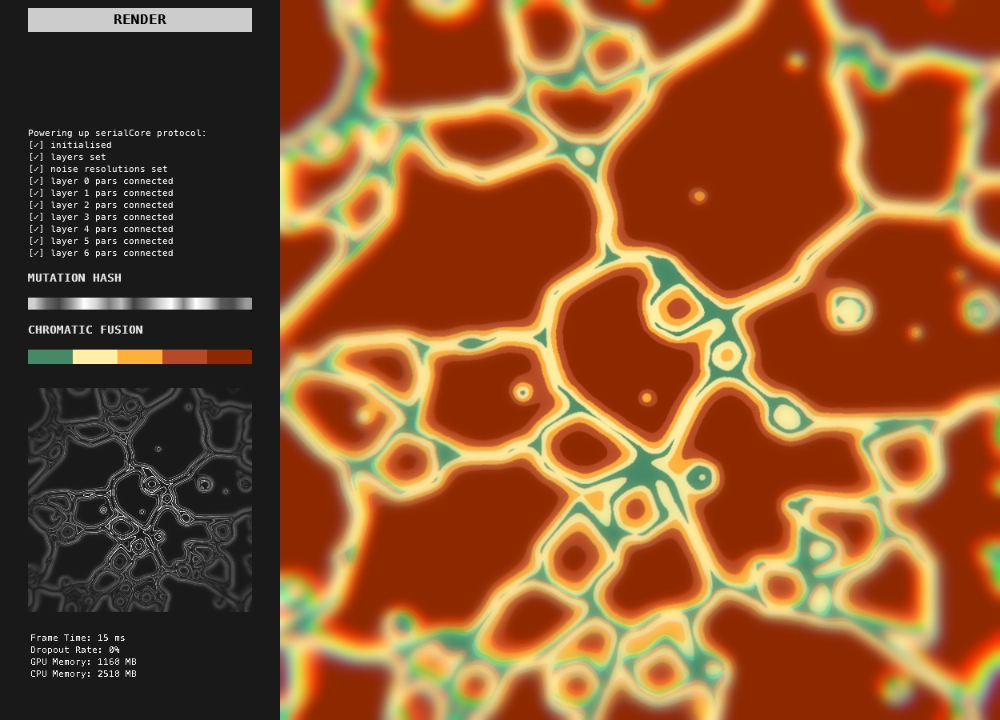
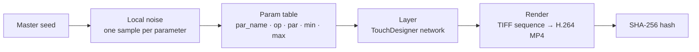

# metacells

**A seeded generative engine in TouchDesigner: one master seed drives every layer through a declarative parameter table, and every render ships with a SHA-256 verification hash.**



## Why it exists

metacells was built to produce a numbered series of looping video works, released as an NFT series on a platform that has since shut down. Each piece had to be unique, reproducible from its seed, and verifiable after the fact.

The interesting part is the system rather than the release: randomness is controlled from one place, parameters are declared as data instead of being wired by hand, and every output can be traced back to its seed and checked against its hash.

## How it works



1. **Master seed.** A single `constant_master_seed` value is bound to the seed of every layer's local noise (`execute_startup.py`). Each render uses the next seed (0, 1, 2…), so any output can be regenerated from its number.
2. **Local noise.** Each layer has a noise CHOP whose resolution is set to the number of parameters in its table, so every parameter gets its own deterministic value in `[0, 1]`.
3. **Param table.** Each layer declares what the seed controls in a tab-separated `table_pars.py`:

   | par_name | op | par | min | max |
   |---|---|---|---|---|
   | `pos_seed` | `noise_pos` | `seed` | 0 | 9000 |
   | `cin_period` | `noise_cinetic` | `period` | 0.01 | 1.0 |
   | `geo_row` | `tube1` | `rows` | 2 | 20 |
   | `blur_size` | `blur1` | `size` | 1 | 32 |

   On startup each row is connected to its operator parameter with an expression; on every value change the noise sample is mapped into `[min, max]` (rounded when `min` is an integer) by `common.mapTableRange`. Adding a parameter is one row, not new wiring. `base_layer_0` is the fully mapped example, with 17 parameters across noise, geometry, levels and blur.
4. **Layer.** Each `base_layer_N` is built from a shared template (texture selector, palette selector from a generated 900-palette library, local noise, mapping tables); the rest of the network is unique to the layer.
5. **Render.** With rendering enabled, `execute_rendering.py` turns off real-time playback, plays the timeline through so the output loops seamlessly, saves a TIFF sequence, and encodes it to a 60 fps H.264 MP4 with ffmpeg.
6. **Hash.** ffmpeg's `hash` muxer writes a SHA-256 of the video's decoded frames next to it (`render/hashes/metacells.<seed>.sha256`), so a piece can be verified later independently of its container metadata. Then the seed increments and the next piece renders.

Output layout:

```
render/
  img-sequence/metacells.<seed>/metacells.<seed>.<frame>.tif
  video/metacells.<seed>.mp4
  hashes/metacells.<seed>.sha256
```

### Adding a layer

1. Copy `_base_layer_template` in the project and rename it to the next number (e.g. `base_layer_7`).
2. Build the network and pick the parameters worth modulating.
3. Create `src/base_layer_7/table_pars.py` with one row per parameter.
4. Restart the project, or press restart in `container_debug`, to reconnect all parameters.

## Run it

Requirements: Windows x64, [TouchDesigner 2021.16270](https://download.derivative.ca/TouchDesigner.2021.16270.exe) or later (the free non-commercial licence works, capped at 1280×1280), and ffmpeg.

```bash
git clone https://github.com/somaticbits/metacells.git
cd metacells
```

1. Download the [ffmpeg release essentials build](https://www.gyan.dev/ffmpeg/builds/ffmpeg-release-essentials.zip), unzip it into the repo and rename the folder to `ffmpeg` (the renderer calls `ffmpeg/bin/ffmpeg.exe`).
2. Open `metacells.toe`.
3. Click **render**. Renders land in `render/` (gitignored).

macOS may work with path changes in `execute_rendering.py`; it has not been tested.

## Status

Built 2021–22 in TouchDesigner 2021.x on Windows. Kept as a reference project; not actively maintained.

Related: [tezos-art-oracles](https://github.com/somaticbits/tezos-art-oracles), my 2022 thesis project on recording physical installations' sensor data on Tezos.

## License

[MIT](LICENSE).
